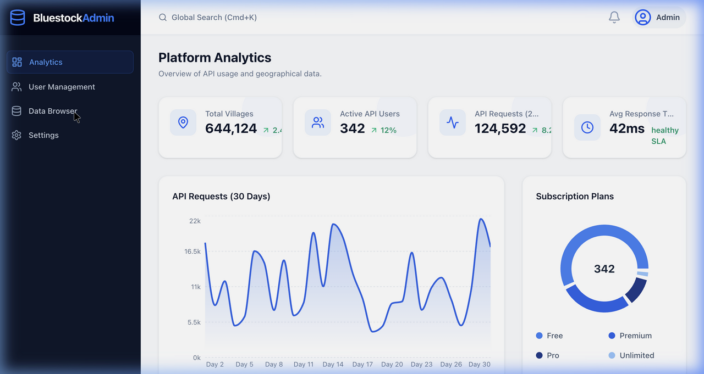

# Bluestock SaaS — Village API Platform

> A production-grade DaaS (Data-as-a-Service) platform providing a RESTful API for topological and geographical data of all 570,000+ villages across India.

 *(Preview of Admin Analytics)*

## Overview
Bluestock SaaS allows developer clients (B2B) to integrate verified Government of India (MDDS) topological hierarchy data directly into their applications. The API allows cascading lookups from States -> Districts -> Sub-Districts -> Villages natively.

The platform is divided into three distinct frontend applications speaking to a single, high-performance Node/Express API with PostgreSQL.

## Architecture

* **Backend / API Wrapper (`/api`)**: Built with Express.js and Prisma ORM. Secures routes via Upstash Redis (rate limiting) and SHA-256 encrypted `X-API-Key` custom authentication. Sits in front of a NeonDB PostgreSQL database with the `pg_trgm` extension for ultra-fast fuzzy searching.
* **B2B Portal (`/b2b-portal`)**: A developer-facing React application designed like Stripe/Vercel. Allows developers to authenticate, view their cycle quotas visually via dashboards, and securely generate "reveal-once" API keys.
* **Admin Dashboard (`/admin-dashboard`)**: A back-office tool for Bluestock internal operations. Views platform analytics, subscription insights, and a Data Browser to traverse the 600k row database directly in the UI.
* **Demo Client (`/demo-client`)**: A lightweight reference UI application mimicking how an end-user developer would consume the geographical endpoints using React hooks.

## Technology Stack
- **Database**: PostgreSQL 17 (NeonDB Cloud)
- **Object-Relational Mapping**: Prisma Client (v5.22.0)
- **Caching & Rate Limiting**: Upstash Redis via `ioredis`
- **Backend API**: Node.js & Express 5
- **Frontend Frameworks**: React 18, Vite, TypeScript
- **Styling**: Tailwind CSS v4, Lucide Icons, Recharts
- **Data Pipeline**: Python 3 ETL Script with `psycopg2` & `pandas`

## Live API Endpoints

| Endpoint | Description | Auth Required |
|----------|-------------|---------------|
| `POST /api/v1/keys` | Generate a new `ak_` & `as_` API Key pair | Internal |
| `GET /api/v1/states` | Fetch list of all 30 available states | `X-API-Key` & `Secret` |
| `GET /states/:id/districts` | Fetch districts belonging to a specific state | `X-API-Key` & `Secret` |
| `GET /districts/:id/subdistricts` | Fetch sub-districts within a district | `X-API-Key` & `Secret` |
| `GET /subdistricts/:id/villages` | Fetch villages belonging to a sub-district | `X-API-Key` & `Secret` |

*Note: Access to state-level data cascades is dependent on the `User`'s subscription plan (e.g., Free vs. Premium vs. Pro).*

## Data Import Workflow
The `dataset/` directory (ignored by git due to size) contains 30 raw `.xls`/`.ods` files from the Government of India MDDS database. 

To ingest this data dynamically:
```bash
python3 scripts/import_data.py
```
*Note: This utilizes a high-throughput, bulk-upsert methodology capable of inserting 600,000 unique records in under ~60 minutes while verifying duplicates natively.*

## Getting Started

1. Clone the repository and install root dependencies:
```bash
git clone https://github.com/akshat333-debug/BlueStock-SaaS.git
npm install
```

2. Generate Prisma typings:
```bash
npm run prisma:generate
```

3. Spin up the backend API and all frontend apps simultaneously in 4 separate terminals:
```bash
npm run dev                  # Terminal 1: Backend API (Port 3000)
cd admin-dashboard && npm run dev  # Terminal 2: Admin Dashboard (Port 5173)
cd b2b-portal && npm run dev       # Terminal 3: Developer Portal (Port 5174)
cd demo-client && npm run dev      # Terminal 4: Demo App (Port 5175)
```

## Contributing
Please see `AGENTS.md` and `CLAUDE.md` for specific architectural boundaries and the GSD operational framework used in this project.
